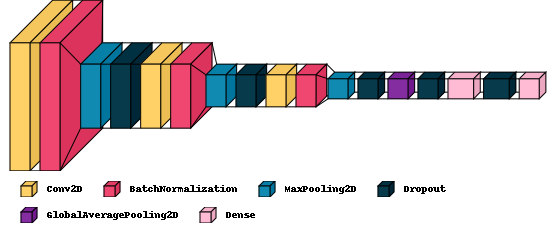
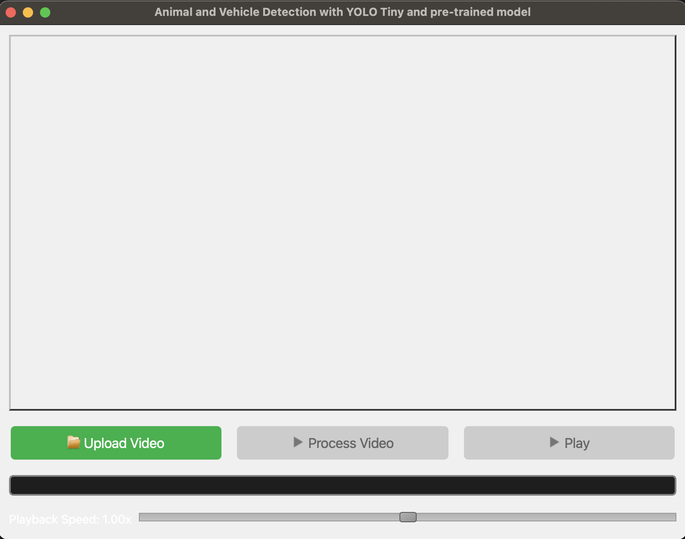
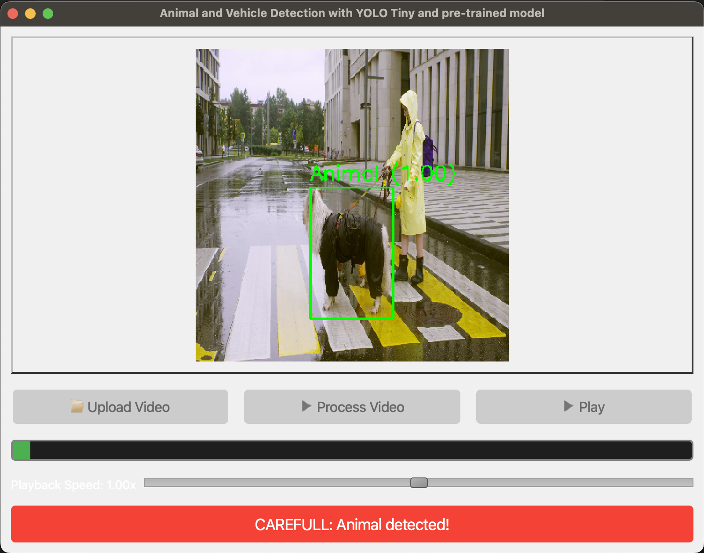

# Image Classification Project - Binary Classification with CNN and Transfer Learning

## Table of Contents

- [Project Overview](#project-overview)
- [Dataset](#dataset)
- [Visualization and Preprocessing](#visualization-and-preprocessing)
- [Custom CNN Models](#custom-cnn-models)
  - [Model Architecture](#model-architecture)
  - [Results of Custom CNNs](#results-of-custom-cnns)
- [Transfer Learning with ResNet50v2](#transfer-learning-with-resnet50v2)
  - [Why ResNet50v2](#why-resnet50v2)
  - [Model Architecture](#transfer-learning-model-architecture)
  - [Results of Transfer Learning](#results-of-transfer-learning)
- [Key Insights](#key-insights)
- [Conclusions](#conclusions)
- [How to Run](#how-to-run)
- [EXTRA: GUI using my model and YOLOv3Tiny](#EXTRA-GUI-using-my-model-and-YOLOv3Tiny)


## Project Overview

This repository is the fifth project of the master's degree in AI Engineering with [Profession AI](https://profession.ai), all the credits for the requests and idea go to this team. 


VisionTech Solutions aims to develop an automatic image recognition system to distinguish between vehicles and animals, with the aim of optimizing wildlife monitoring operations in urban areas, avoiding road accidents and protecting both animals and vehicles. VisionTech Solutions works with municipal administrations to implement a real-time monitoring system in cities, using cameras installed along the roads to identify and classify vehicles and animals. This system will help prevent road accidents caused by the sudden crossing of animals, warning drivers through electronic road signs.

Benefits:
- Process Automation
- Increased Accuracy
- Operational Efficiency
- Multiple Applications

Project steps and information:
* Dataset
    - Use of the CIFAR dataset, containing thousands of images labeled in various categories, including vehicles and animals.
* Algorithm
    - Implementation of a convolutional neural network (CNN) for image analysis and classification.
* Output:
    - The system will correctly classify each image as a vehicle or an animal.
* Model Evaluation:
    - Accuracy: Proportion of correctly classified images compared to the total.
    - Precision: Quality of positive predictions, indicating the proportion of correctly identified images.
* Results Analysis:
    - Identification of any error patterns.
    - Evaluation of the categories of images systematically confused.
    - Examination of the erroneous images and reflection on possible improvements to the model.

## Dataset
The [**CIFAR-10**](https://www.tensorflow.org/datasets/catalog/cifar10) dataset, which consists of 60,000 32x32 color images in 10 different classes (airplanes, birds, cars, etc.), was used in this project. For the purpose of **binary classification**, I selected **two specific classes** for classification:

- **Class 1**: Vehicles
- **Class 2**: Animals

These classes were chosen because they present challenges for classification due to their similarities in certain cases (planes and birds both appearing in the sky). 

The dataset is split into training, validation, and test sets:
- **Training set**: Used for training the models.
- **Validation set**: Used for model evaluation during training to tune hyperparameters and avoid overfitting.
- **Test set**: Used for final evaluation of model performance.

## Visualization and Preprocessing

### Data Preprocessing

I employed **ImageDataGenerator** to augment the training data. This approach helped increase the diversity of the training dataset through techniques such as rotation, width and height shifts, and horizontal flips. Data augmentation is beneficial as it can improve model generalization by introducing variability in the training samples, reducing the likelihood of overfitting.

### Interactive Plots with Plotly

To enhance the analysis of model performance, I utilized **Plotly** to create interactive graphs. These visualizations feature dropdown menus, allowing users to select different metrics to view, which makes it easy to compare the performances of various models.

### 3D Visualization with Visualkeras

For a better understanding of the custom CNN architectures, I employed [**Visualkeras**](https://github.com/paulgavrikov/visualkeras). This library enabled me to generate a 3D representation of the model structure, providing insights into the flow of data through the network layers.

 

### Confusion Matrix

To assess the classification performance on the test dataset, I used a confusion matrix. This visualization highlights the true versus predicted classifications, making it clear where the model tends to make mistakes—particularly with classes that share similar visual features, such as birds and airplanes.

These visual tools not only facilitated a deeper understanding of model performance but also aided in diagnosing areas for improvement. You can find everything in the [`noteboook`](CNN_model.ipynb).

## Custom CNN Models

### Model Architecture

The custom CNN models were built from scratch and structured in a modular fashion, comprising three main convolutional blocks, each followed by pooling and regularization layers. The overall architecture is as follows:

1. **Conv Block 1**:
   - 2 convolution layers (filters = 32, kernel = 3x3) with ReLU activation.
   - Batch Normalization for stability.
   - MaxPooling layer for downsampling.
   - Dropout (0.3) to prevent overfitting.

2. **Conv Block 2**:
   - 2 convolution layers (filters = 64, kernel = 3x3) with ReLU activation.
   - Batch Normalization for normalization.
   - MaxPooling for further downsampling.
   - Dropout (0.3) for regularization.

3. **Conv Block 3**:
   - 2 convolution layers (filters = 128, kernel = 3x3) with ReLU activation.
   - Batch Normalization.
   - MaxPooling and Dropout (0.3).

After the convolutional blocks, **Global Average Pooling** was applied to reduce the dimensionality of the feature maps, followed by several dense layers for final classification.

The configurations of **Dropout**, **Batch Normalization**, and **L2 regularization** in the dense layers were fine-tuned across multiple runs. I also manually adjusted the learning rate of the Adam optimizer, balancing it to avoid overfitting while improving the model's ability to generalize.

The number of units in dense layers, filters in convolutional layers, and other hyperparameters were adjusted iteratively until the model consistently achieved **over 90% accuracy** on the training set.

### Results of Custom CNNs

Below is the summary of the training and validation performance metrics, including accuracy, loss, and precision. The metrics include both mean and standard deviation in the same column for clarity. For further details about how models were built, see `Description` in [results csv](Results/report_results.csv)

| Model  | Training Accuracy (Mean ± Std) | Training Loss (Mean ± Std) | Training Precision (Mean ± Std) | Validation Accuracy (Mean ± Std) | Validation Loss (Mean ± Std) | Validation Precision (Mean ± Std) |
|--------|-------------------------------|----------------------------|---------------------------------|----------------------------------|-----------------------------|------------------------------------|
| Model 1| 91.17% ± 1.45%                | 0.2371 ± 0.0479            | 92.05% ± 1.14%                 | 91.05% ± 2.45%                  | 0.2392 ± 0.0664             | 93.25% ± 4.53%                    |
| Model 2| 93.19% ± 1.89%                | 0.1884 ± 0.0607            | 93.83% ± 1.57%                 | 92.52% ± 2.63%                  | 0.2004 ± 0.0673             | 96.05% ± 2.63%                    | 
| Model 3| 91.83% ± 1.79%                | 0.2426 ± 0.0512            | 91.97% ± 1.20%                 | 91.15% ± 6.18%                  | 0.2587 ± 0.1642             | 94.74% ± 2.83%                    | 
| Model 4| 93.16% ± 2.21%                | 0.1837 ± 0.0532            | 93.81% ± 1.81%                 | 94.14% ± 1.24%                  | 0.1644 ± 0.0320             | 94.97% ± 1.83%                    | 
| Model 5| 93.29% ± 1.91%                | 0.1869 ± 0.0742            | 93.76% ± 1.58%                 | 92.34% ± 3.10%                  | 0.2055 ± 0.0906             | 96.55% ± 1.43%                    | 

These performance values reflect how the custom models were optimized progressively, with **Model 4** achieving the best overall results on both training and validation data.

Below are the results of the best-performing models on test set:

| Model  | Test Loss | Test Accuracy | Test Precision |
|--------|-----------|---------------|----------------|
| Model 1| 0.156     | 94.19%        | 95.18%         |
| Model 2| 0.123     | 95.37%        | 95.54%         |
| Model 3| 0.146     | 95.37%        | 96.96%         |
| Model 4| 0.121     | 95.32%        | 96.63%         |
| Model 5| 0.131     | 95.00%        | 95.31%         |

Models 2 and 4 showed the best overall performance, with high accuracy and precision. Some errors were observed with images of birds and planes, which visually resemble each other.

## Transfer Learning with ResNet50v2

### Why ResNet50v2?

ResNet50v2 was chosen for transfer learning because of its:
- **Residual connections**, which enable deeper networks without suffering from vanishing gradients.
- **Performance efficiency**: Despite being large, ResNet50v2 strikes a good balance between depth and computational efficiency.
- **Pre-trained on ImageNet**: This enables faster convergence and better generalization on smaller datasets like CIFAR-10.

Other models like **InceptionV3** or **EfficientNetB0** could have been depper analysed but were not due to computational constraints. You can find every detail in [`models.py`](src/models.py)

### Transfer Learning Model Architecture

The ResNet50v2 model was modified as follows:

- **Input shape**: CIFAR-10 images were upsampled from 32x32 to 224x224 to match ResNet50v2's input requirements.
- **ResNet50v2 Base**: The base model was loaded with pre-trained ImageNet weights, with the top layers removed (`include_top=False`).
- **Global Average Pooling**: Replaces fully connected layers for a more compact representation.
- **Dense layers**: 
  - 512 units, ReLU activation
  - 256 units, ReLU activation
- **Output layer**: Single unit with sigmoid activation for binary classification.

**Optimizer**: Adam (learning rate = 1e-4)  
**Loss Function**: Binary crossentropy  
**Metrics**: Accuracy, Precision  

To manage the learning rate, I used a dynamic approach with the `ReduceLROnPlateau` callback.

### Results of Transfer Learning

The ResNet50v2 model achieved a high validation/test accuracy, but slightly lower training accuracy, likely due to have completely freezed the ResNet layers. Here are the final results:

- **Validation accuracy**: 98,4%
- **Training accuracy**: 98,2%/98,3%
- **Test accuracy**: 98,7%

The discrepancy between training and validation accuracy is likely due to the following factors:
- Dropout was too aggressive during training, leading to underfitting.
- The pre-trained base was not fine-tuned enough to fit the specific dataset.

## Key Insights

- **Custom CNNs**: Achieved strong performance with relatively simple architectures. Errors were observed in distinguishing visually similar classes (e.g., birds vs. planes).
- **Transfer Learning**: Provided even better performance, especially for validation data, but may require additional fine-tuning to fully utilize the pre-trained model's potential.

## Conclusions

- **Custom CNNs** provide a good baseline with ~95% accuracy on the test set, showing that carefully designed convolutional layers with regularization techniques like dropout and batch normalization can work well.
- **Transfer learning** with ResNet50v2 achieved the best results (~98% validation accuracy), but further tuning is required to close the gap between training and validation performance, so to completely avoid underfitting.

## How to Run

### Prerequisites

- Python 3.x
- TensorFlow/Keras
- Required libraries (`requirements.txt`):
  ```bash
  pip install -r requirements.txt
  ```

### EXTRA: GUI using my model and YOLOv3Tiny

The project is organized as follows:
```
vehicle_animal_detection/
├── config/
│   └── config.yaml
├── src/
│   ├── detection/
│   │   └── yolo_detector.py
│   ├── classification/
│   │   └── classifier.py
│   ├── gui/
│   │   └── main_window.py
├── models/
│   ├── yolo_tiny/
│   │   ├── yolov3-tiny.weights
│   │   ├── yolov3-tiny.cfg
│   │   └── coco.names
│   └── classification_model/
│       └── tf_model_2.keras
├── main.py
```

### Packages and Technologies Used

- **PyQt5**: Chosen for its robust GUI capabilities and cross-platform support.
- **OpenCV (cv2)**: Used for image processing and YOLO implementation due to its efficiency and wide range of computer vision algorithms.
- **TensorFlow**: Powers custom classifier model, selected for its flexibility and extensive ecosystem.
- **YAML**: Used for configuration management, providing a human-readable format for easy adjustments.

### YOLO (You Only Look Once)

I implemented YOLOv3-Tiny, a lightweight version of the YOLO object detection system. While not as accurate as full YOLO versions, it offers a good balance between speed and accuracy, making it suitable for real-time applications with limited computational resources.

### GUI Preview

#### Initial Screen


#### Animal Detection in Action


### Project Limitations and Future Improvements

1. **YOLO Version**: I used an older, lighter version of YOLO. Upgrading to YOLOv5 or YOLOv8 could significantly improve detection accuracy.

2. **Computational Constraints**: The project is designed to run on CPU, which limits real-time performance. GPU acceleration could greatly enhance processing speed.

3. **Classifier Limitations**: My classifier was trained on the CIFAR10 dataset, which is not ideal for the specific task of animal detection in road scenarios. A custom dataset focused on road animals would yield better results.

4. **Potential Improvements**:
   - Implement a more advanced model from Hugging Face Transformers for classification.
   - Use transfer learning on a pre-trained model with a custom dataset of road animals.
   - Explore object tracking algorithms to maintain consistent detection across video frames.

5. **Real-world Application**: While this project serves as a proof of concept, deploying such a system in actual self-driving cars would require extensive testing, optimization, and integration with other vehicular systems.

Despite these limitations, this project demonstrates the potential of combining object detection and classification for specific use cases like animal detection on roads, providing a foundation for further development and optimization.
